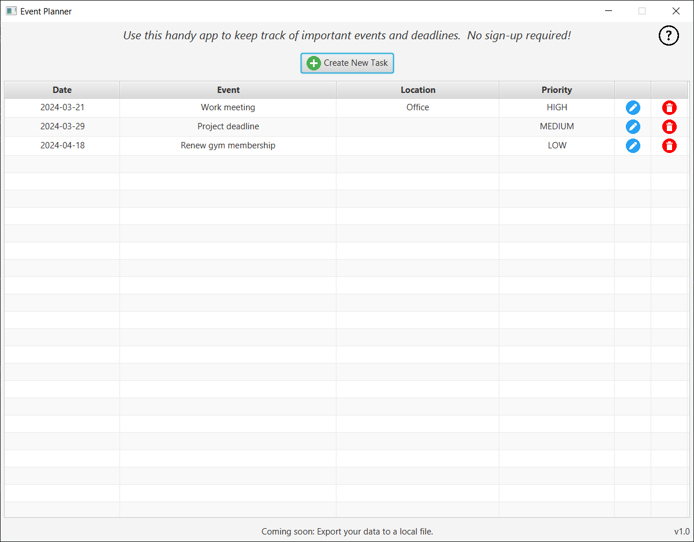
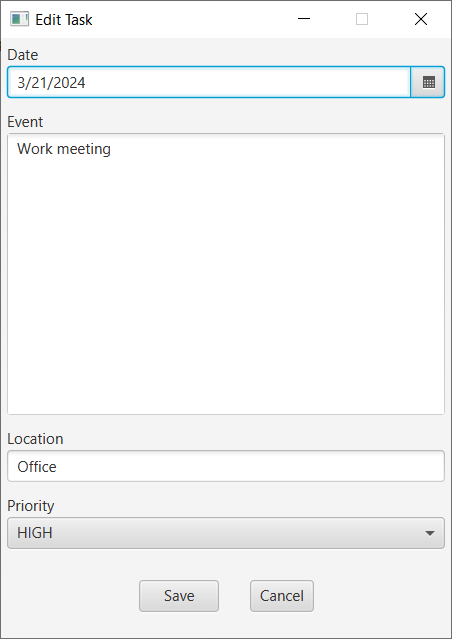

## Event Planner

A prototype JavaFX event-planning desktop app with support for creating, editing, and deleting tasks.
Follows software engineering best practices for initial design, project management (JIRA), accessibility, inclusivity, 
and agile methods.  Interfaces with a partner microservice (implemented by teammate) for various features.

To run:
1. Clone repo.
2. Install [JDK 21+](https://adoptium.net/).
3. Set the `JAVA_HOME` environment variable to your JDK directory.
4. Execute `./mvnw.cmd javafx:run` on Windows, or `./mvnw javafx:run` on Linux/Mac.
5. Note: some features will be unavailable without the companion microservice.

 

